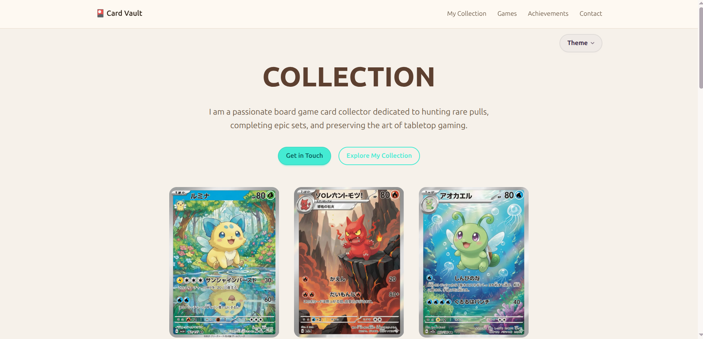
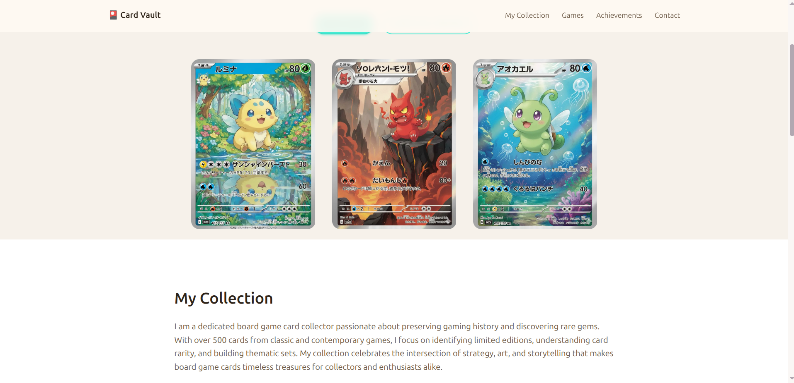
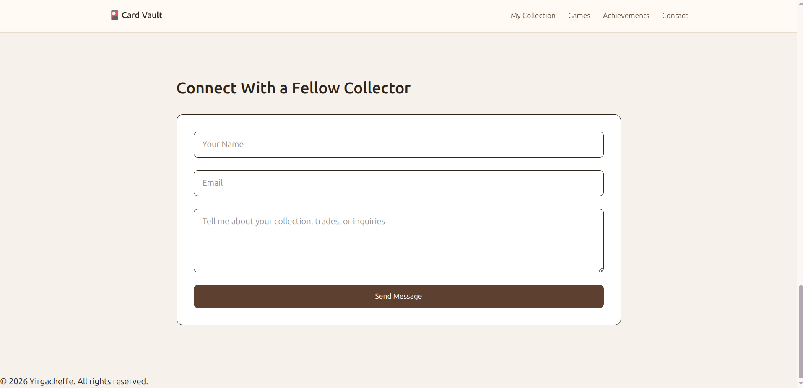

# 🎴 Card Collector's Vault

A modern, responsive web experience designed to showcase the passion and artistry behind trading card collecting. This project highlights rare cards, curated collections, and personal achievements in an elegant, interactive format.

---

## 🌟 Overview

**Card Collector's Vault** is a personal showcase website built to celebrate the world of trading and board game cards. It combines clean UI design with interactive elements to create an engaging experience for collectors and enthusiasts alike.

The site includes:

* A hero section introducing the collector’s passion
* A featured collection gallery
* Favorite trading card games
* Personal achievements and milestones
* A contact form for networking with other collectors

---

## 💡 Inspiration

This project was inspired by:

* The excitement of opening rare card packs
* The visual artistry found in trading cards
* The collector culture around games like *Magic: The Gathering*, *Pokémon*, and *Yu-Gi-Oh!*
* The idea of turning a personal hobby into a **digital showcase portfolio**

The goal was to create something that feels like a **digital vault** — warm, collectible, and slightly nostalgic.

---

## ✨ Features

* 🎨 **Clean, warm UI design** inspired by collectible aesthetics
* 📱 **Fully responsive layout** (mobile + desktop)
* 🎴 **Interactive card elements** with hover effects
* 🧭 **Sticky navigation + mobile menu**
* 🎚️ **Theme switching (DaisyUI)**
* 📸 **Image gallery for featured cards**
* 📬 **Contact form for collaboration or trading**

---

## 🛠️ Tech Stack

* **HTML5**
* **Tailwind CSS**
* **DaisyUI**
* **Vanilla JavaScript**

---

## 📸 Screenshots

> 📌 Replace the image paths below with your actual screenshots (store them in `/assets` or `/screenshots`)

### 🏠 Hero Section



### 🎴 Card Showcase



### 📚 Collection Section


### 🎮 Favorite Games



---

## 🚀 Getting Started

### 1. Clone the repository

```bash
git clone https://github.com/your-username/card-vault.git
```

### 2. Open the project

```bash
cd card-vault
open index.html
```

---

## 🎨 Customization

You can easily personalize the project:

* Replace images with your own card collection
* Update text content (collection, achievements, etc.)
* Add new sections (e.g. wishlist, trade history)
* Modify themes using DaisyUI

---

## ⚠️ Known Issues

* Some UI effects may require additional CSS fine-tuning
* Ensure all images are optimized for performance

---

## 🔮 Future Improvements

* Add backend for saving collections
* User authentication for multiple collectors
* Card filtering and search functionality
* Integration with trading APIs or databases

---

## 📬 Contact

Feel free to connect if you're a fellow collector or developer!

---

## 📄 License

This project is licensed under the MIT License.

---

## 🙌 Acknowledgements

* Tailwind CSS
* DaisyUI
* Unsplash (for placeholder images)

---
